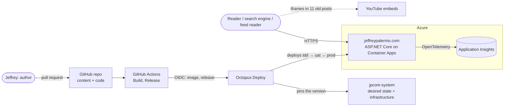
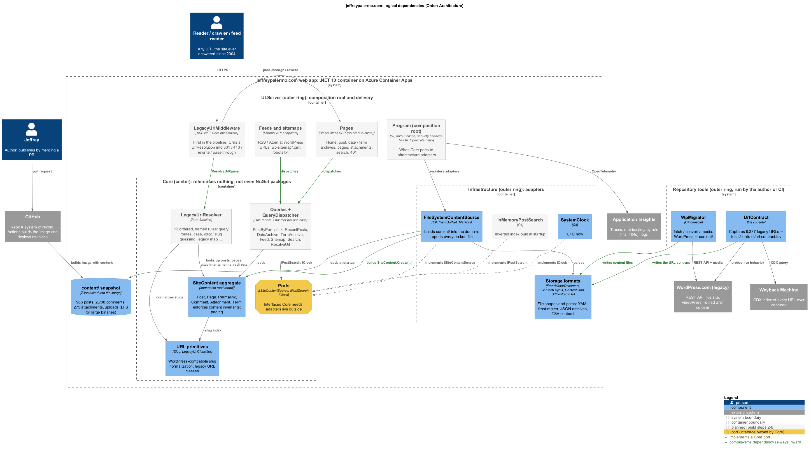
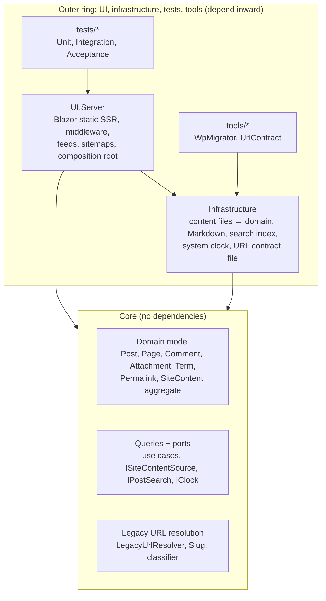
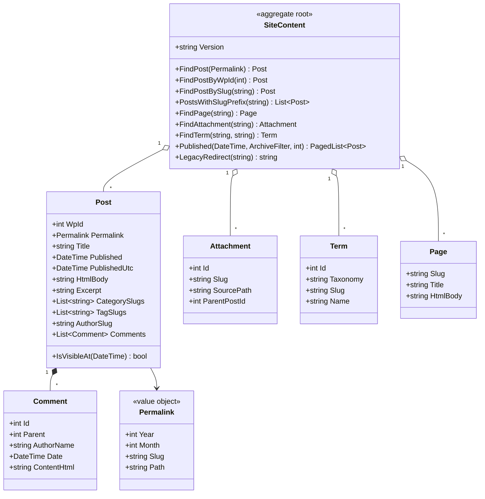
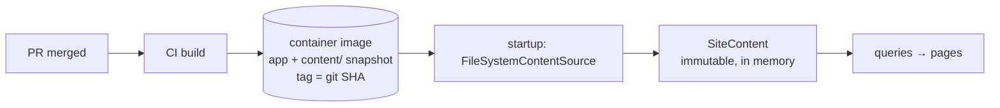
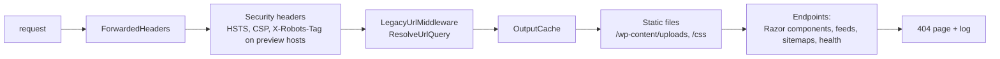
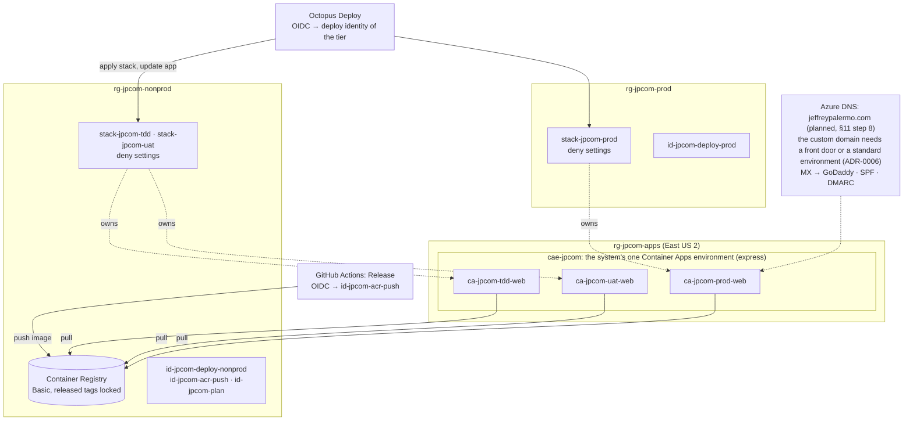
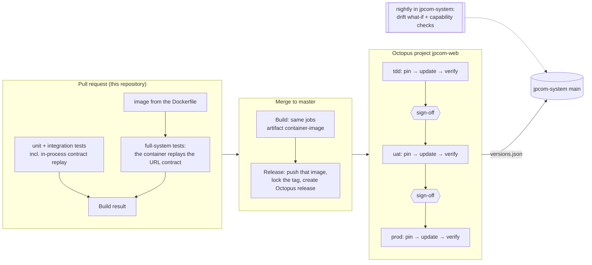

# Web application architecture

_Architecture pass, 2026-10-05. Decisions are recorded as ADRs in [`docs/adr`](../adr)._

This document designs the ASP.NET Core application that replaces the WordPress.com site (Option D in
[MODERNIZATION-PLAN.md](../../MODERNIZATION-PLAN.md)). It covers the Onion Architecture layering, the data layer,
how legacy URLs are preserved, the Azure deployment, the GitOps delivery pipeline, and the build sequence.
Sections 8 and 9 were rewritten on 2026-10-06 for [ADR-0006](../adr/0006-deliver-through-the-demo-environment-kit.md).

## 1. Architectural drivers

| Driver | Measure | Consequence |
|---|---|---|
| **Preserve every legacy URL** | All 9,337 entries in [`tests/contract/url-contract.tsv`](../../tests/contract/url-contract.tsv) satisfy the [contract rules](../../tests/contract/README.md) | URL resolution is domain logic in Core, tested against the contract on every PR and before every production traffic shift |
| **Content is code** | Publishing a post = merging a PR | Git is the system of record ([ADR-0002](../adr/0002-git-is-the-system-of-record.md)) |
| **Showcase** | A reader can understand the whole system from the repo | Onion layering enforced by tests; every decision has an ADR; infra and pipeline are in the repo |
| **Performance** | Server time p95 < 50 ms for cached pages; no framework JavaScript | In-memory read model, output caching, Blazor static SSR with no client runtime |
| **Cost** | < $25/month at launch | Container apps that scale to zero, no database, no CDN until traffic justifies it |
| **Operability** | Zero-downtime deploys; rollback by redeploying the previous release; every legacy hit observable | Octopus releases promoted through tdd, uat and prod ([ADR-0006](../adr/0006-deliver-through-the-demo-environment-kit.md)); OpenTelemetry metrics per URL rule |
| **Security** | No writable surface in v1 | No database, no admin UI, no secrets; managed identity only; strict headers |
| **Testability** | Definition of Done: unit, integration, full-system tests per change | Core has no dependencies; adapters behind ports; Playwright drives the running container |

## 2. System context

There are no runtime calls to third-party systems in v1. The only external dependency is the YouTube iframes in
11 old posts, which the reader's browser loads.

## 3. Onion layers

_C4 component view rendered from [`diagrams/logical-dependencies.puml`](diagrams/logical-dependencies.puml) (PlantUML stdlib C4). Grey boxes are planned for build steps 2–6; green arrows are compile-time dependencies, which always point inward._

**The dependency rule:** source dependencies point inward only. Core references no project and **no NuGet
package**. It knows nothing about files, YAML, Markdown, HTTP, Blazor, or Azure. Infrastructure implements Core's
ports. UI.Server is the composition root that wires them together. A unit test enforces the rule (§10).

### Projects

| Project | Ring | Responsibility | References |
|---|---|---|---|
| `src/Core` | center | Domain model, invariants, queries, ports, legacy URL resolution | nothing |
| `src/Infrastructure` | outer | Load `content/` into the domain (YAML front matter, Markdig), in-memory search index, system clock, URL contract file format | Core, YamlDotNet, Markdig |
| `src/UI.Server` | outer | Blazor static SSR pages, legacy-URL middleware, feeds, sitemaps, headers, caching, health, OpenTelemetry, DI composition | Core, Infrastructure |
| `tools/WpMigrator`, `tools/UrlContract` | outer | One-time migration and contract capture (exist today) | Infrastructure |
| `tests/UnitTests` | outer | Core and Infrastructure in isolation, plus architecture rules | all |
| `tests/IntegrationTests` | outer | Real `content/` tree, in-process HTTP pipeline, full contract replay | all |
| `tests/AcceptanceTests` | outer | The published app and the container image over real HTTP; Playwright for .NET from build step 3 | tools/UrlContract (the contract verifier) |

`UI.Server` keeps Jeffrey's Onion DevOps naming and leaves room for a `UI.Client` project if interactive islands
are ever needed.

### Changes to existing code

The migration increment put two persistence shapes in Core. Move them out during build step 1:

- `Core/Content/PostMetadata` is the front-matter DTO. Move it to `Infrastructure/Content/PostFrontMatter`. Core gets
  a real `Post` entity. The YAML shape and the domain can then evolve separately.
- `Core/Urls/UrlContractEntry` describes a test artifact. Move it to `Infrastructure/Urls` beside `UrlContractFile`.
  `LegacyUrlClassifier` and `Slug` stay in Core because the resolver uses them.
- `Comment`, `Attachment`, and `Term` stay in Core as domain records. They currently double as the JSON shape. If the
  storage shape ever diverges, add DTOs in Infrastructure.

## 4. Domain model (Core)

- **`SiteContent` is the aggregate root** of the read model. It's built once per process by
  `SiteContent.Create(...)`, which **enforces the content invariants**: unique permalinks, unique WordPress ids,
  comment parents exist, terms referenced by posts exist, and legacy redirect targets exist. A violation throws
  `ContentValidationException` listing every error. Bad content fails the PR build, not production.
- **Bodies arrive as HTML.** Markdown-to-HTML conversion is an Infrastructure concern done while loading, so Core
  never sees Markdown.
- **Scheduled posts:** `Post.IsVisibleAt(now)` with `IClock` lets a future-dated post merge early and appear on its
  date without a redeploy.
- **Pagination is 10 per page**, matching WordPress, so `/page/N/` and archive pages show the same posts they did
  before.

### Queries (use cases)

Each query is an immutable record with one handler. A ~20-line `QueryDispatcher` in Core resolves handlers from DI
and wraps each call in an OpenTelemetry `Activity`, which gives uniform tracing without a mediator library
(MediatR moved to a commercial license in 2025).

| Query | Result | Used by |
|---|---|---|
| `PostByPermalinkQuery` | post, comments thread, previous/next, related series | post page |
| `RecentPostsQuery(page)` | `PagedList<PostSummary>` | home, `/page/N/` |
| `DateArchiveQuery(y, m?, d?, page)` | paged summaries | `/2008/`, `/2008/07/`, `/2008/07/29/` |
| `TermArchiveQuery(taxonomy, slug, page)` | term + paged summaries | `/tag/x/`, `/category/x/`, `/author/x/` |
| `PageBySlugQuery`, `AttachmentBySlugQuery` | page / attachment with parent post | `/about/`, attachment pages |
| `FeedQuery(scope)` | feed items (site, comments, post comments, term) | feed endpoints |
| `SitemapQuery` | URL entries with last-modified dates | `wp-sitemap*.xml` |
| `SearchQuery(text, page)` | ranked summaries via `IPostSearch` | `/search`, `/?s=` |
| `ResolveUrlQuery(UrlRequest)` | `UrlResolution` | legacy-URL middleware |

### Ports

| Port (Core) | v1 adapter (Infrastructure) | Later adapter |
|---|---|---|
| `ISiteContentSource` | `FileSystemContentSource`: reads `content/` from the image | precompiled content bundle, if startup ever needs it |
| `IPostSearch` | `InMemoryPostSearch`: inverted index built at startup | Azure AI Search, for semantic search and "ask the archive" |
| `IClock` | `SystemClock` | fixed clock in tests |

## 5. Data layer

**Decision ([ADR-0002](../adr/0002-git-is-the-system-of-record.md)): git is the system of record. Content is baked
into the container image, and the app serves from an immutable in-memory read model. There is no database in v1.**

Why this fits:
- **Size:** all post HTML is 3.3 MB, comments are ~3 MB, and media is 33 MB. The read model is a few tens of MB in
  memory, and loading takes well under a second.
- **Change rate:** content only changes through PRs. A database would duplicate git, need a sync process, add a
  failure mode and monthly cost, and weaken the "one commit = one release" property.
- **GitOps:** each image is a complete, immutable snapshot of code *and* content. Rollback restores both together.
- **Media is content.** Uploads ship in the image and are served by ASP.NET Core static files with long cache
  lifetimes. **Every image the site shows is self-hosted.** The 222 images old posts loaded through WordPress.com's
  Photon CDN or from third-party hosts are localized under `content/uploads/external/{host}/…` (§12): 155 were
  recovered, and the 67 nobody has any more answer 404 locally instead of from a dead host. That lets the content
  security policy say `img-src 'self'`. An integration test fails when a post refers to an image on another host.

Runtime writes don't exist in v1. Read-only archived comments ship with their posts, and new comments are deferred
(§13). The ADR sets the triggers for adding a store: the first runtime-write feature (newsletter signup, contact
form, AI usage logs) adds a `DataAccess` adapter project. The default choice then is **Azure SQL Database (serverless)
with EF Core and a managed-identity connection**, behind a port defined in Core.

## 6. Legacy URL resolution

**Decision ([ADR-0004](../adr/0004-legacy-url-resolution-in-core.md)):** a pure function in Core,
`LegacyUrlResolver.Resolve(UrlRequest, SiteContent) → UrlResolution`, runs as the first middleware on every request.
It returns one of:

- `PassThrough`: a canonical URL, so routing renders it
- `Redirect(location, rule)`: 301
- `Rewrite(path, rule)`: served internally without changing the URL
- `Gone(rule)`: 410
- `NotFound(rule)`: 404, for legacy URLs known to be dead (e.g. WordPress soft-404s)

Every non-pass-through result carries the **rule name** that fired. It's recorded as a metric dimension, so the
data shows which legacy behaviors are still being used.

Rules, in precedence order (implemented in build step 2; every one has a unit test):

| # | Rule | Example | Result |
|---|---|---|---|
| 1 | `host-www`, `host-feeds` | `www.jeffreypalermo.com/x`, `feeds.jeffreypalermo.com/jeffreypalermo` | 301 → `https://jeffreypalermo.com/x`, `/feed/` |
| 2 | `wordpress-system` | `/wp-admin/`, `/xmlrpc.php`, `/wp-json/…`, `/wp-content/plugins/…`, `/_static/…`, `/jetpack/v4/…` | 410 |
| 3 | `query-p`, `query-page-id`, `query-attachment-id`, `query-feed`, `query-cat`, `query-tag`, `query-author`, `query-m`, `query-year`, `query-paged` (on `/` only) | `/?p=945`, `/?attachment_id=28`, `/?feed=rss2` | 301 → canonical; 404 when the id doesn't exist |
| 4 | `query-search` | `/?s=onion` | rewrite → `/search/?q=onion` (URL unchanged) |
| 5 | `index-php` | `/index.php` | 301 → `/` |
| 6 | `media` | `/wp-content/uploads/a.png?w=300` | pass through (static files ignore Photon resize params) |
| 7 | `canonical` | posts, pages, attachments, archives, term archives, feeds, sitemaps | pass through (tracking query ignored) |
| 8 | `trailing-slash` | `/2008/07/the-onion-architecture-part-1` | 301 → with slash (one hop, straight to the final URL) |
| 9 | `case` | `/2008/07/The-Onion-Architecture-Part-1/` | 301 → canonical |
| 10 | `legacy-map` | curated `content/archive/legacy-redirects.json` | 301 → mapped target |
| 11 | `graffiti-files` | `/files/media/…` (WordPress soft-404s) | 404 unless mapped |
| 12 | `page-one`, `sitemap-alias` | `/page/1/`, `/sitemap.xml` | 301 → `/`, `/wp-sitemap.xml` |
| 13 | `graffiti-index`, `graffiti-feed`, `graffiti-slug`, `graffiti-archive` | `/blog/`, `/blog/?p=2`, `/blog/feed/`, `/blog/{slug}/`, `/archive/?year=2008&month=7` | 301 → `/`, `/page/2/`, `/feed/`, the post, `/2008/07/` |
| 14 | `post-subpath`, `post-feed-alias` | `/…/slug/amp/`, `/…/slug/110/`, `/…/slug/feed/rss2/` | 301 → the post or its feed |
| 15 | `term-subpath` | `/tag/onion-architecture/86` | 301 → the term archive |
| 16 | `feed-alias` | `/feed/rss/`, `/feed/rdf/`, `/pwp/feed/` | 301 → `/feed/` |
| 17 | `junk-root` | `/,` | 301 → `/` |
| 18 | `slug-guess` | `/contact/`, `/pwp/{slug}/`, `/2008/07/the` | WordPress's 404 guesser: last segment as an exact slug, else a prefix of ≥ 3 characters; within the URL's month first; ties go to the oldest post |
| — | `none` | anything else | pass through, then routing 404s |

The WordPress-era behavior for case variants and query-string archives was to answer 200 at the alias. Answering a
single 301 to the canonical URL is better for SEO, and the contract rules count it as preserved.

**Verification:** the contract replay runs in-process in integration tests (all 9,337 rows, seconds), over HTTP
against the container image in every build, and against each environment after a deployment (§9).

## 7. UI.Server

**Decision ([ADR-0005](../adr/0005-blazor-static-ssr.md)): Blazor static server-side rendering, with no interactive
render modes and no `blazor.web.js`.** Pages are Razor components that render to plain HTML. The search form is a
GET form. Interactive islands can be added later per component without changing the architecture.

### Request pipeline

### Routes

| Route | Component / endpoint |
|---|---|
| `/`, `/page/{n}/` | `Home` (positioning, featured series, recent posts) |
| `/{year}/{month}/{slug}/` | `PostPage` (body, archived comments, era banner on posts > 5 years old, prev/next) |
| `/{year}/`, `/{year}/{month}/`, `/{year}/{month}/{day}/` (+ `/page/{n}/`) | `DateArchive` |
| `/tag/{slug}/`, `/category/{slug}/`, `/author/{slug}/` (+ `/page/{n}/`) | `TermArchive` |
| `/{slug}/` | `PageOrAttachment` (About, 275 attachment pages) |
| `/search` | `Search` |
| `/feed/`, `/feed/atom/`, `/comments/feed/`, `/…/feed/` | minimal API feed endpoints (RSS 2.0 stays the default format readers already use) |
| `/wp-sitemap.xml`, `/wp-sitemap-*.xml`, `/robots.txt` | minimal API endpoints. Search engines already know the WordPress sitemap names, so they're kept. |
| `/_health/live`, `/_health/ready` | liveness; readiness = content loaded, answering `ready <version>`. `/_health/ready` is the health path every deployment verifies |

### Cross-cutting

- **Caching:** the read model is immutable per process, so output caching keyed by path (and page number) is safe
  with long in-memory lifetimes. Responses carry `ETag` = content version (the git SHA). `Cache-Control`: HTML
  `public, max-age=600, stale-while-revalidate=86400`; uploads `public, max-age=2592000`; feeds 15 minutes.
- **Security headers:** HSTS (the old site already sent `max-age=31536000`, so HTTPS must stay); CSP
  `default-src 'self'; img-src 'self' data:; frame-src https://www.youtube.com https://www.youtube-nocookie.com;
  style-src 'self' 'unsafe-inline'` (old posts use inline style attributes); `script-src 'self'` once the one post
  with a script is reviewed. Also `X-Content-Type-Options`, `Referrer-Policy`, and `X-Robots-Tag: noindex` on every
  host except the canonical domain, so preview URLs never get indexed.
- **Observability:** `Azure.Monitor.OpenTelemetry.AspNetCore` for traces, metrics, and logs. Custom
  `ActivitySource("JeffreyPalermo.Site")` around queries; metrics `site.legacy_url.resolutions{rule,result}` and
  `site.not_found{referrer_host}`. The 404 log is the feed for new `legacy-map` entries.
- **Configuration:** no secrets in v1. Only the App Insights connection string, set as an environment variable by
  the system's `telemetry` capability, the canonical host name, and the version, which the image carries.

## 8. Azure deployment

**Decisions: [ADR-0003](../adr/0003-azure-container-apps.md) (Azure Container Apps, consumption) and
[ADR-0006](../adr/0006-deliver-through-the-demo-environment-kit.md) (the system `jpcom`, made with the
demo-environment-kit, gives the pipeline, the identities and the registry) and
[ADR-0007](../adr/0007-the-site-owns-its-runtime.md) (the site's own runtime is code in this repository).** The
container app of each environment is `deploy/infra/main.bicep`, applied by `deploy/deploy.ps1`. The system repository
`jeffreypalermo-sites/jpcom-system` holds the desired state: which release each environment runs.

_Since [ADR-0008](../adr/0008-eleven-regions-behind-front-door.md) the diagram and table below describe one region
of one environment. `tdd` runs in one region, `uat` in two and `prod` in eleven, each region with an express
environment and a container app of its own (`cae-jpcom-<env>-<code>`, `ca-jpcom-<env>-web-<code>`); `uat` and `prod`
have an Azure Front Door in front that rotates over their regions. `deploy/settings.json` lists the regions._

| Resource | Settings | Notes |
|---|---|---|
| Container Apps environment `cae-jpcom` | Azure Container Apps express; no static IP; resource group `rg-jpcom-apps`; East US 2 | Created once by the kit's seed, not by an environment. Counts against the express quota (200 per region), not the standard one. Prod shares this runtime with nonprod (ADR-0006) |
| Container apps `ca-jpcom-<env>-web` | ingress on 8080; health path `/_health/ready`; scale to zero (ADR-0006) | One per environment: `tdd`, `uat`, `prod`. Each is this repository's `deploy/infra/main.bicep`, applied as the stack `stack-jpcom-<env>-web` in its tier's resource group by `deploy/deploy.ps1`, and joins `cae-jpcom` (ADR-0007) |
| Deployment stacks `stack-jpcom-<env>` | deny settings | Only the tier's deploy identity changes an environment's resources. A nightly what-if reports drift from `jpcom-system` |
| Container Registry | Basic | Images `jpcom/web:<version>`. Pulled by each environment's runtime identity, so no registry password exists. A released tag is write- and delete-locked |
| Identities | user-assigned, federated (GitHub OIDC, Octopus OIDC) | Push: `id-jpcom-acr-push`. Deploy: `id-jpcom-deploy-nonprod`, `id-jpcom-deploy-prod`. Read-only previews and drift: `id-jpcom-plan`. No client secret |
| Log Analytics + App Insights | the system's `telemetry` capability, per environment | Sets `APPLICATIONINSIGHTS_CONNECTION_STRING` for the app's OpenTelemetry export (build step 5) |
| Azure DNS zone, custom domain | not in the kit yet; open (ADR-0006) | An express environment takes no custom domain or certificate, so `jeffreypalermo.com`, `www` and `feeds` can't be bound to the prod app. They need a front door in front of prod, or prod in a standard environment. The DNS move itself is unchanged: off WordPress.com nameservers, keep GoDaddy MX, fix SPF, add DMARC |

There is no SQL server, no SQL secret and no database runbook: the system has no database (ADR-0002).

**Cost:** the registry (Basic) is the one fixed charge. Three container apps that scale to zero run within the
subscription's monthly free grant (180,000 vCPU-seconds, 360,000 GiB-seconds, 2M requests), which other systems in
the subscription share. A warm production replica, once the kit can set one per environment, uses that grant all
month.

**Azure Front Door** was deferred until traffic, WAF, or global latency justified ~$35+/month. On an express
environment it is now one of the two ways to serve the custom domain at all; the other is a standard environment
for prod. That choice is open (ADR-0006) and comes before any DNS work.

## 9. Delivery pipeline (GitOps)

Git is the single source of truth, in two repositories. This one holds content and code: every post and every code
change is a pull request here. `jpcom-system` holds the desired state: `system.json`, the infrastructure templates,
the Octopus configuration, and the version each environment runs (`environments/<env>/versions.json`). Octopus
Deploy carries a release from one environment to the next and writes the pin, so `jpcom-system`'s `main` always says
what runs where.

| Step | What happens | Where |
|---|---|---|
| Build | Unit and integration tests. The image is built once from the `Dockerfile`, run as a container, and must pass the full-system tests (all 9,337 contract URLs over HTTP) before it's kept as the artifact `container-image`. `Build result` is the required check | `.github/workflows/build.yml`, this repository |
| Release | After a green Build of `master`: that image goes to the registry as `jpcom/web:<version>`, its tag is locked, the `deploy/` folder goes to the Octopus feed as the package `jpcom-web.<version>.zip`, and release `<version>` of `jpcom-web` is created. Nothing is rebuilt | `release.yml`, added by the kit when it adopts this repository |
| Deploy | "Pin version" commits the version to `jpcom-system`, "Update deployable" runs this repository's `deploy/deploy.ps1` from the release's package (it applies the container app with the release's image), "Verify deployable" runs `deploy/verify.ps1` (`/_health/ready` must answer `ready <version>`). "Revert pin" runs when a step fails | Octopus project `jpcom-web`; the scripts are this repository's (ADR-0007) |
| Promote | `tdd` deploys on its own. `uat` and `prod` each start with a sign-off | Octopus lifecycle |
| Infrastructure | A pull request to `jpcom-system` runs `env-checks` and previews a what-if. A merge applies the Octopus configuration and releases `jpcom-system`, which applies and verifies each environment's stack through the same promotion | `jpcom-system` |

The version is `MAJOR_VERSION.MINOR_VERSION.<run number>` from `build.yml`. The image carries it, and
`/_health/ready` answers `ready <version>`, so any environment says which release it runs.

| Onion DevOps Architecture stage | This site |
|---|---|
| Private build | `dotnet test JeffreyPalermo.slnx` (needs Docker for the container tests) |
| Integration build | `Build` on every push and pull request: unit, integration, full-system, container image |
| TDD environment | `tdd`: every release of `master` deploys here on its own |
| UAT | `uat`, after a sign-off |
| Production | `prod`, after a sign-off. Rollback = redeploy the previous release, whose image is locked in the registry |

**Container image:** the `Dockerfile` at the root publishes `src/UI.Server` with the .NET SDK and copies `content/`
beside it, on the chiseled, non-root `aspnet:10.0` base image. Large uploads are stored with Git LFS, so the image
must be built from a checkout with LFS; the build fails if an upload is still a pointer.

**After a deployment** the site's own `verify.ps1` checks that `/_health/ready` answers as the release and replays
the whole URL contract against the environment, with the verifier and the contract the release's package carries
(ADR-0007). A violation fails the deployment and reverts the pin. The workflow `Verify environments` replays the
contract against every environment each night as well ([tests/contract](../../tests/contract/README.md)): what it
catches is a change outside a deployment. While an environment fails, an issue labelled `url-contract` stays open.

## 10. Testing strategy (Definition of Done)

| Layer | What | Where it runs |
|---|---|---|
| **Unit** | The kit's contract in `build.yml` (`BuildWorkflowContractTests`); `SiteContent` invariants and queries; every resolver rule (table-driven, one case per rule plus precedence conflicts); pagination; feed item selection; front matter and Markdown loading; **architecture rules** (Core references no project and no package; Infrastructure doesn't reference UI.Server) | every build |
| **Integration** | `FileSystemContentSource` over the **real `content/` tree**, which validates every PR's content; `WebApplicationFactory` tests: **full contract replay (9,337 rows)**, feed XML validity, sitemaps, headers/CSP, caching, health | every build |
| **Full-system (acceptance)** | The published app as a process and the **container image built from the `Dockerfile`**, each over real HTTP: full contract replay, the version on the health path, uploads served as files (not Git LFS pointers), an unprivileged user on port 8080, and the nightly verification script against the container, a site that doesn't answer and a site that breaks the contract. From build step 3, Playwright for .NET drives the container in a real browser: home, post with comments, archives, tag pages, search, feed link, 404 page, legacy redirects. YouTube iframes are stubbed by Playwright request interception; there are no other third-party calls | every build; the image that passes is the image released |
| **Post-deploy verification** | The site's `verify.ps1` after every deployment: `/_health/ready` answers `ready <version>`, and the full contract replay passes against the environment. `Verify environments` replays the contract every night as well | every deployment, in tdd, uat and prod; every night (§9) |

## 11. Build sequence

Each step is one PR that meets the Definition of Done.

1. **Domain and content loading.** `Post`, `Permalink`, and `SiteContent` with invariants; `FileSystemContentSource`
   (+ Markdig for `.md`); move `PostMetadata` and `UrlContractEntry` out of Core; architecture tests; integration
   test that loads the real `content/` tree.
2. **Legacy URL resolver, contract-first.** `LegacyUrlResolver` + rules; `UI.Server` skeleton with only the
   middleware and stub endpoints; in-process contract replay green **before** any page is designed.
3. **Pages.** Layout, post page, home + pagination, date/term archives, pages and attachment pages, search, 404;
   first Playwright suite.
4. **Feeds, sitemaps, robots.txt.**
5. **Operability.** OpenTelemetry, health checks, security headers, output caching, ETags.
6. **Delivery.** The `Dockerfile` and `build.yml` here; the system `jpcom` provisioned with the demo-environment-kit
   (`tdd`, `uat`, `prod`); the contract replayed against each environment (ADR-0006).
7. **Visual design.** Home page positioning (Chief Architect at Clear Measure, books, podcast, talks), typography,
   the Onion Architecture hub page.
8. **Cutover runbook.** DNS move with MX/SPF/DMARC, TTL lowering, production contract replay, WordPress.com kept
   read-only for 30 days.

## 12. Migration findings to resolve before cutover

| Finding | Count | Plan |
|---|---|---|
| Images in posts loaded through WordPress.com Photon (`i0.wp.com/<external host>/…`) or hotlinked from third parties | 222 | ✅ Localized 2026-10-06: `src` points at `/wp-content/uploads/external/{host}{path}`, fetched from Photon's cache, else the original host, else the Wayback Machine. 155 recovered; 67 are in `migration/uploads-manifest.missing.txt` (no source has them). `media` is re-runnable if a copy turns up |
| Graffiti-era `/files/media/…` images (the live site returns a 29-byte soft 404) | 43 | ✅ 40 recovered from the Wayback Machine with the images above, under `uploads/external/jeffreypalermo.com/files/media/…`; posts point at them. Still open: redirecting the old `/files/media/…` URLs themselves to the recovered files via `legacy-map` |
| Images with no file name to store them under (a tracking pixel, Google thumbnails and a map, `.aspx` image handlers, one on `localhost`) | 8 | Left as they are and pinned as reviewed leftovers in `FileSystemContentSourceTests`. Remove each from its post or replace it by hand |
| VideoPress video hosted on `videos.files.wordpress.com` (Palermo Pamphlet 001, 76 MB) | 1 | ✅ Localized under `uploads/external/` in build step 1; large binaries are stored with Git LFS |
| Unrendered `[podcast src=…]` shortcodes in old posts (already broken on the live site) | a few | Replace with the Libsyn embed or a link when the post pages are built |
| Uploads already 404 on the live site (lost in the 2018 import) | 44 | Recover from the Wayback Machine; list in `migration/uploads-manifest.missing.txt` |
| Community Server `.aspx` URLs (already 404) | 64 in contract | Map to posts by title using Wayback captures, into `legacy-redirects.json` |
| Graffiti `/blog/` slugs WordPress fails to guess | 63 | Prefix-match rule plus curated map entries |
| Content written on WordPress after the snapshot | 0 on 2026-10-06 | ✅ The site is frozen ([ADR-0010](../adr/0010-the-wordpress-site-is-frozen.md)): `convert` refuses `content/`, and `WordPress drift` compares the old site with `content/archive/wordpress-freeze.json` every night |

## 13. Decisions and open questions

Decided 2026-10-06 (recommendations approved):
- **New comments: closed at launch.** The 2,708 archived comments are shown read-only. Revisit with data; giscus or a
  store-backed form (which triggers the database ADR) are the options.
- **Azure region: East US 2, on an Azure Container Apps express environment.** Central US could not create a
  standard environment on 2026-10-06 and the subscription's standard quota was used up, so the system runs on
  express (ADR-0006).
- **Delivery:** the system `jpcom` of the demo-environment-kit, with one Container Apps environment for all three
  environments ([ADR-0006](../adr/0006-deliver-through-the-demo-environment-kit.md)).
- **Repository home:** `jeffreypalermo-sites/jeffreypalermo.com`, public.

Open:
- **Newsletter:** an external provider's embed vs our own signup endpoint (would trigger the database ADR).
- **Search quality:** the in-memory index is enough for 966 posts. Azure AI Search arrives with "ask the archive".
- **The custom domain for prod:** on the Front Door endpoint (ADR-0008); binding it and moving DNS wait for Jeffrey.
- **A warm production replica:** the site launches with scale to zero. The kit's `alwaysOn` pins exactly one
  replica, so a per-environment minimum is asked of the kit (ADR-0006).
