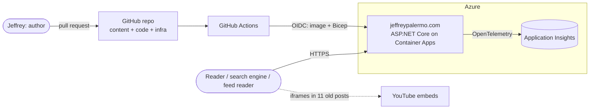
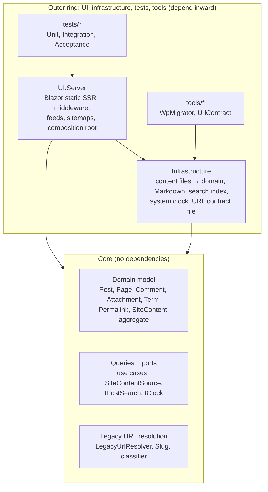
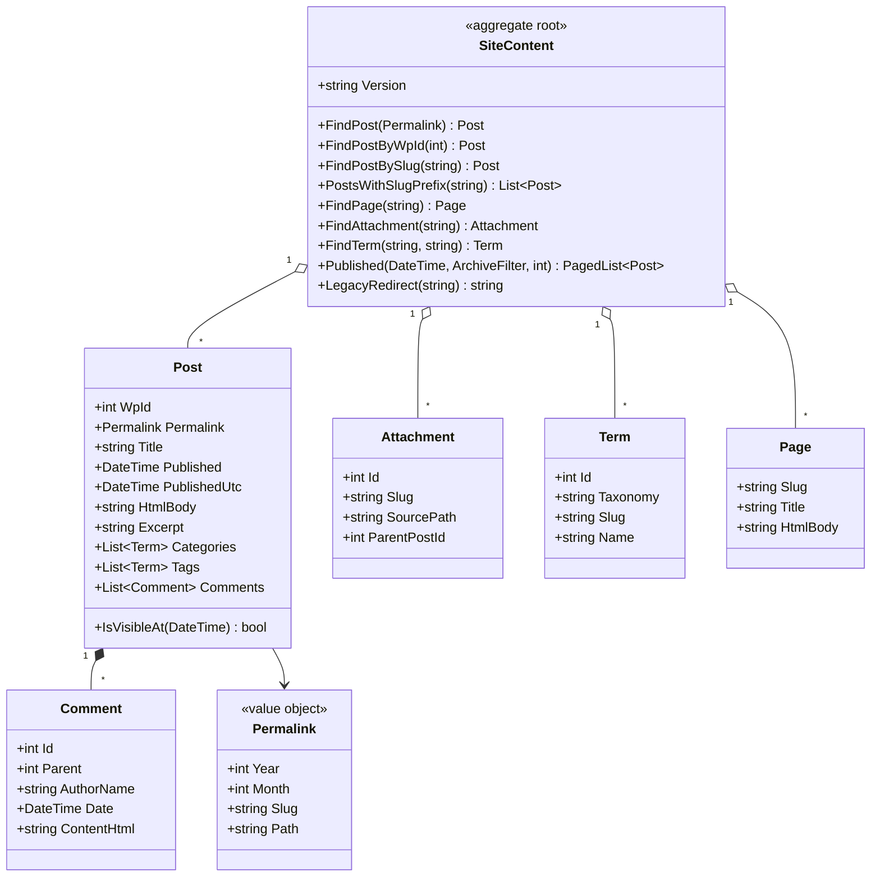
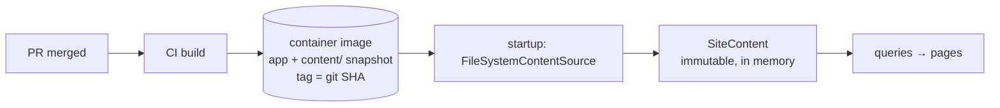
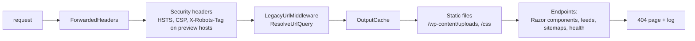
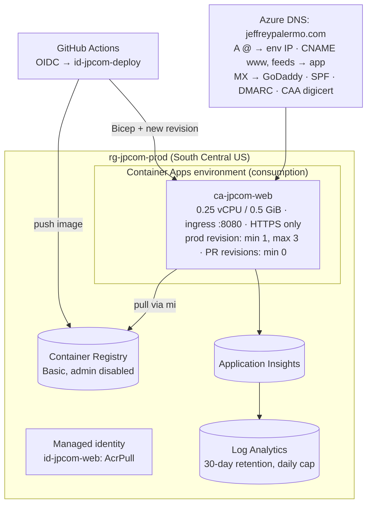
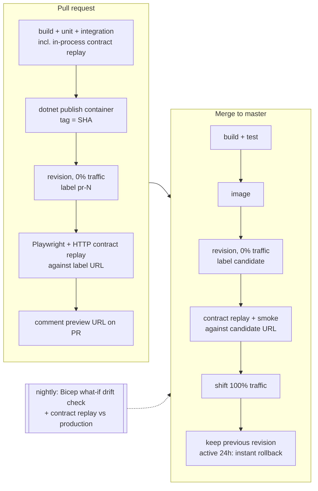

# Web application architecture

_Architecture pass, 2026-10-05. Decisions are recorded as ADRs in [`docs/adr`](../adr)._

This document designs the ASP.NET Core application that replaces the WordPress.com site (Option D in
[MODERNIZATION-PLAN.md](../../MODERNIZATION-PLAN.md)). It covers the Onion Architecture layering, the data layer,
how legacy URLs are preserved, the Azure deployment, the GitOps delivery pipeline, and the build sequence.

## 1. Architectural drivers

| Driver | Measure | Consequence |
|---|---|---|
| **Preserve every legacy URL** | All 9,337 entries in [`tests/contract/url-contract.tsv`](../../tests/contract/url-contract.tsv) satisfy the [contract rules](../../tests/contract/README.md) | URL resolution is domain logic in Core, tested against the contract on every PR and before every production traffic shift |
| **Content is code** | Publishing a post = merging a PR | Git is the system of record ([ADR-0002](../adr/0002-git-is-the-system-of-record.md)) |
| **Showcase** | A reader can understand the whole system from the repo | Onion layering enforced by tests; every decision has an ADR; infra and pipeline are in the repo |
| **Performance** | Server time p95 < 50 ms for cached pages; no framework JavaScript | In-memory read model, output caching, Blazor static SSR with no client runtime |
| **Cost** | < $25/month at launch | One Azure Container App, no database, no CDN until traffic justifies it |
| **Operability** | Zero-downtime deploys; rollback < 1 minute; every legacy hit observable | Container Apps revisions with traffic shifting; OpenTelemetry metrics per URL rule |
| **Security** | No writable surface in v1 | No database, no admin UI, no secrets; managed identity only; strict headers |
| **Testability** | Definition of Done: unit, integration, full-system tests per change | Core has no dependencies; adapters behind ports; Playwright drives the running container |

## 2. System context

There are no runtime calls to third-party systems in v1. The only external dependency is the YouTube iframes in
11 old posts, which the reader's browser loads.

## 3. Onion layers

**The dependency rule:** source dependencies point inward only. Core references no project and **no NuGet
package**. It knows nothing about files, YAML, Markdown, HTTP, Blazor, or Azure. Infrastructure implements Core's
ports. UI.Server is the composition root that wires them together. A unit test enforces the rule (§10).

### Projects

| Project | Ring | Responsibility | References |
|---|---|---|---|
| `src/Core` | center | Domain model, invariants, queries, ports, legacy URL resolution | nothing |
| `src/Infrastructure` | outer | Load `content/` into the domain (YAML front matter, Markdig), in-memory search index, system clock, URL contract file format | Core, YamlDotNet, Markdig |
| `src/UI.Server` | outer | Blazor static SSR pages, legacy-URL middleware, feeds, sitemaps, headers, caching, health, OpenTelemetry, DI composition | Core, Infrastructure |
| `tools/WpMigrator`, `tools/UrlContract` | outer | One-time migration and contract capture (exist today) | Infrastructure |
| `tests/UnitTests` | outer | Core and Infrastructure in isolation, plus architecture rules | all |
| `tests/IntegrationTests` | outer | Real `content/` tree, in-process HTTP pipeline, full contract replay | all |
| `tests/AcceptanceTests` | outer | Playwright for .NET against the running container | UI.Server (for config only) |

`UI.Server` keeps Jeffrey's Onion DevOps naming and leaves room for a `UI.Client` project if interactive islands
are ever needed.

### Changes to existing code

The migration increment put two persistence shapes in Core. Move them out during build step 1:

- `Core/Content/PostMetadata` is the front-matter DTO. Move it to `Infrastructure/Content/PostFrontMatter`. Core gets
  a real `Post` entity. The YAML shape and the domain can then evolve separately.
- `Core/Urls/UrlContractEntry` describes a test artifact. Move it to `Infrastructure/Urls` beside `UrlContractFile`.
  `LegacyUrlClassifier` and `Slug` stay in Core because the resolver uses them.
- `Comment`, `Attachment`, and `Term` stay in Core as domain records. They currently double as the JSON shape. If the
  storage shape ever diverges, add DTOs in Infrastructure.

## 4. Domain model (Core)

- **`SiteContent` is the aggregate root** of the read model. It's built once per process by
  `SiteContent.Create(...)`, which **enforces the content invariants**: unique permalinks, unique WordPress ids,
  comment parents exist, terms referenced by posts exist, and legacy redirect targets exist. A violation throws
  `ContentValidationException` listing every error. Bad content fails the PR build, not production.
- **Bodies arrive as HTML.** Markdown-to-HTML conversion is an Infrastructure concern done while loading, so Core
  never sees Markdown.
- **Scheduled posts:** `Post.IsVisibleAt(now)` with `IClock` lets a future-dated post merge early and appear on its
  date without a redeploy.
- **Pagination is 10 per page**, matching WordPress, so `/page/N/` and archive pages show the same posts they did
  before.

### Queries (use cases)

Each query is an immutable record with one handler. A ~20-line `QueryDispatcher` in Core resolves handlers from DI
and wraps each call in an OpenTelemetry `Activity`, which gives uniform tracing without a mediator library
(MediatR moved to a commercial license in 2025).

| Query | Result | Used by |
|---|---|---|
| `PostByPermalinkQuery` | post, comments thread, previous/next, related series | post page |
| `RecentPostsQuery(page)` | `PagedList<PostSummary>` | home, `/page/N/` |
| `DateArchiveQuery(y, m?, d?, page)` | paged summaries | `/2008/`, `/2008/07/`, `/2008/07/29/` |
| `TermArchiveQuery(taxonomy, slug, page)` | term + paged summaries | `/tag/x/`, `/category/x/`, `/author/x/` |
| `PageBySlugQuery`, `AttachmentBySlugQuery` | page / attachment with parent post | `/about/`, attachment pages |
| `FeedQuery(scope)` | feed items (site, comments, post comments, term) | feed endpoints |
| `SitemapQuery` | URL entries with last-modified dates | `wp-sitemap*.xml` |
| `SearchQuery(text, page)` | ranked summaries via `IPostSearch` | `/search`, `/?s=` |
| `ResolveUrlQuery(UrlRequest)` | `UrlResolution` | legacy-URL middleware |

### Ports

| Port (Core) | v1 adapter (Infrastructure) | Later adapter |
|---|---|---|
| `ISiteContentSource` | `FileSystemContentSource`: reads `content/` from the image | precompiled content bundle, if startup ever needs it |
| `IPostSearch` | `InMemoryPostSearch`: inverted index built at startup | Azure AI Search, for semantic search and "ask the archive" |
| `IClock` | `SystemClock` | fixed clock in tests |

## 5. Data layer

**Decision ([ADR-0002](../adr/0002-git-is-the-system-of-record.md)): git is the system of record. Content is baked
into the container image, and the app serves from an immutable in-memory read model. There is no database in v1.**

Why this fits:
- **Size:** all post HTML is 3.3 MB, comments are ~3 MB, and media is 33 MB. The read model is a few tens of MB in
  memory, and loading takes well under a second.
- **Change rate:** content only changes through PRs. A database would duplicate git, need a sync process, add a
  failure mode and monthly cost, and weaken the "one commit = one release" property.
- **GitOps:** each image is a complete, immutable snapshot of code *and* content. Rollback restores both together.
- **Media is content.** Uploads ship in the image and are served by ASP.NET Core static files with long cache
  lifetimes. **Every image the site shows is self-hosted.** About 230 images in old posts are still hotlinked through
  WordPress.com's Photon CDN or from third-party hosts, and 88 are already broken. Localizing them is migration work
  (§12) that lets the content security policy say `img-src 'self'`.

Runtime writes don't exist in v1. Read-only archived comments ship with their posts, and new comments are deferred
(§13). The ADR sets the triggers for adding a store: the first runtime-write feature (newsletter signup, contact
form, AI usage logs) adds a `DataAccess` adapter project. The default choice then is **Azure SQL Database (serverless)
with EF Core and a managed-identity connection**, behind a port defined in Core.

## 6. Legacy URL resolution

**Decision ([ADR-0004](../adr/0004-legacy-url-resolution-in-core.md)):** a pure function in Core,
`LegacyUrlResolver.Resolve(UrlRequest, SiteContent) → UrlResolution`, runs as the first middleware on every request.
It returns one of:

- `PassThrough`: a canonical URL, so routing renders it
- `Redirect(location, rule)`: 301
- `Rewrite(path, rule)`: served internally without changing the URL
- `Gone(rule)`: 410

Every non-pass-through result carries the **rule name** that fired. It's recorded as a metric dimension, so the
data shows which legacy behaviors are still being used.

Rules, in precedence order:

| # | Rule | Example | Result |
|---|---|---|---|
| 1 | `host-www` | `www.jeffreypalermo.com/x` | 301 → `https://jeffreypalermo.com/x` |
| 2 | `host-feeds` | `feeds.jeffreypalermo.com/jeffreypalermo` | 301 → `/feed/` |
| 3 | `wordpress-system` | `/wp-admin/`, `/wp-login.php`, `/xmlrpc.php`, `/wp-json/…` | 410 |
| 4 | `query-route` (on `/` only) | `?p=945`, `?page_id=`, `?attachment_id=`, `?feed=rss2`, `?m=200807`, `?cat=`, `?tag=`, `?author=` | 301 → canonical |
| 5 | `query-search` | `/?s=onion` | rewrite → `/search?q=onion` |
| 6 | `canonical` | `/2008/07/the-onion-architecture-part-1/?utm_source=…` | pass through (tracking query ignored) |
| 7 | `trailing-slash` | `/2008/07/the-onion-architecture-part-1` | 301 → with slash |
| 8 | `case` | `/2008/07/The-Onion-Architecture-Part-1/` | 301 → canonical |
| 9 | `legacy-map` | `/blogs/jeffrey.palermo/archive/2005/09/13/131914.aspx`, `/files/media/…` | 301 → mapped target (curated `content/archive/legacy-redirects.json`) |
| 10 | `graffiti-slug` | `/blog/getting-started-with-the-asp.net-mvc-framework/` | normalized slug match, else **unique** prefix match (WordPress's guesser) → 301 |
| 11 | `post-subpath` | `/…/slug/amp/`, `/…/slug/trackback/`, `/…/slug/2/`, `/…/slug/attachment/x/` | 301 → post or attachment page; `/…/slug/feed/` passes through to the comments feed |
| 12 | `top-level-slug` | `/the-onion-architecture-part-1-3/`, `/about/` | pass through (attachment or page); a post slug → 301 to the post |
| 13 | `media-query` | `/wp-content/uploads/a.png?w=300` | pass through (the static file ignores Photon resize params) |
| — | none | anything else | pass through, then routing 404s; logged with referrer |

The WordPress-era behavior for case variants and query-string archives was to answer 200 at the alias. Answering a
single 301 to the canonical URL is better for SEO, and the contract rules count it as preserved.

**Verification:** the contract replay runs in-process in integration tests (all 9,337 rows, seconds) and over HTTP
against each new revision before it receives traffic (§9).

## 7. UI.Server

**Decision ([ADR-0005](../adr/0005-blazor-static-ssr.md)): Blazor static server-side rendering, with no interactive
render modes and no `blazor.web.js`.** Pages are Razor components that render to plain HTML. The search form is a
GET form. Interactive islands can be added later per component without changing the architecture.

### Request pipeline

### Routes

| Route | Component / endpoint |
|---|---|
| `/`, `/page/{n}/` | `Home` (positioning, featured series, recent posts) |
| `/{year}/{month}/{slug}/` | `PostPage` (body, archived comments, era banner on posts > 5 years old, prev/next) |
| `/{year}/`, `/{year}/{month}/`, `/{year}/{month}/{day}/` (+ `/page/{n}/`) | `DateArchive` |
| `/tag/{slug}/`, `/category/{slug}/`, `/author/{slug}/` (+ `/page/{n}/`) | `TermArchive` |
| `/{slug}/` | `PageOrAttachment` (About, 275 attachment pages) |
| `/search` | `Search` |
| `/feed/`, `/feed/atom/`, `/comments/feed/`, `/…/feed/` | minimal API feed endpoints (RSS 2.0 stays the default format readers already use) |
| `/wp-sitemap.xml`, `/wp-sitemap-*.xml`, `/robots.txt` | minimal API endpoints. Search engines already know the WordPress sitemap names, so they're kept. |
| `/healthz`, `/readyz` | liveness; readiness = content loaded |

### Cross-cutting

- **Caching:** the read model is immutable per process, so output caching keyed by path (and page number) is safe
  with long in-memory lifetimes. Responses carry `ETag` = content version (the git SHA). `Cache-Control`: HTML
  `public, max-age=600, stale-while-revalidate=86400`; uploads `public, max-age=2592000`; feeds 15 minutes.
- **Security headers:** HSTS (the old site already sent `max-age=31536000`, so HTTPS must stay); CSP
  `default-src 'self'; img-src 'self' data:; frame-src https://www.youtube.com https://www.youtube-nocookie.com;
  style-src 'self' 'unsafe-inline'` (old posts use inline style attributes); `script-src 'self'` once the one post
  with a script is reviewed. Also `X-Content-Type-Options`, `Referrer-Policy`, and `X-Robots-Tag: noindex` on every
  host except the canonical domain, so preview URLs never get indexed.
- **Observability:** `Azure.Monitor.OpenTelemetry.AspNetCore` for traces, metrics, and logs. Custom
  `ActivitySource("JeffreyPalermo.Site")` around queries; metrics `site.legacy_url.resolutions{rule,result}` and
  `site.not_found{referrer_host}`. The 404 log is the feed for new `legacy-map` entries.
- **Configuration:** no secrets in v1. Only the App Insights connection string, set as an environment variable from
  Bicep, and the canonical host name.

## 8. Azure deployment

**Decision ([ADR-0003](../adr/0003-azure-container-apps.md)): Azure Container Apps (consumption), in multiple
revision mode, with labels.**

| Resource | SKU / settings | Notes |
|---|---|---|
| Container App | consumption; 0.25 vCPU, 0.5 GiB; production revision min 1 replica | Min 1 avoids cold starts on the first request. An idle replica bills at the reduced idle rate. |
| Container Apps environment | consumption; static IP | The apex A record points here |
| Container Registry | Basic | ~$5/mo. Pull via managed identity, so no registry password exists anywhere |
| Log Analytics + App Insights | workspace-based, 30-day retention, daily ingestion cap | Container Apps requires the workspace anyway |
| Azure DNS zone | public | Moves DNS off WordPress.com nameservers, keeps GoDaddy MX, fixes SPF, adds DMARC |
| Managed certificates | free, per custom domain | Apex needs an A record to the environment IP; `www`/`feeds` need a CNAME **directly** to the app |
| Deploy identity | user-assigned identity with GitHub OIDC federated credentials | Roles: AcrPush, Contributor on the resource group. No client secret |

**Estimated cost:** about $10–20/month. That's ACR Basic, one mostly idle replica beyond the monthly free grant
(180,000 vCPU-seconds, 360,000 GiB-seconds, 2M requests), small Log Analytics ingestion, and the DNS zone.

**Deferred: Azure Front Door.** Add it when traffic, WAF, or global latency justifies ~$35+/month. Because managed
certificates require direct DNS to the app, adding Front Door later moves the certificates to Front Door. That
switch is planned for, not a surprise.

## 9. Delivery pipeline (GitOps)

Git is the single source of truth for content, code, and infrastructure (Bicep). Every change reaches production
through a PR. Deployment is push-based from GitHub Actions: Container Apps has no pull-based reconciler like Flux.
Drift is caught by a scheduled `what-if`.

| Onion DevOps Architecture stage | This site |
|---|---|
| Private build | `dotnet test JeffreyPalermo.slnx` (later `build.ps1`) |
| Integration build | CI on every push: build, unit, integration, in-process contract replay, container image |
| TDD environment | PR revision (label `pr-N`), scales to zero, torn down when the PR closes |
| UAT | the `candidate` revision, verified at 0% traffic |
| Production | traffic shift to `candidate`. Rollback = shift traffic back to the previous revision |

**Container image:** built with the .NET SDK (`dotnet publish /t:PublishContainer`) on the chiseled, non-root
`aspnet:10.0` base image, so there's no Dockerfile to maintain. `content/` is copied into the publish output.

## 10. Testing strategy (Definition of Done)

| Layer | What | Where it runs |
|---|---|---|
| **Unit** | `SiteContent` invariants and queries; every resolver rule (table-driven, one case per rule plus precedence conflicts); pagination; feed item selection; front matter and Markdown loading; **architecture rules** (Core references no project and no package; Infrastructure doesn't reference UI.Server) | every build |
| **Integration** | `FileSystemContentSource` over the **real `content/` tree**, which validates every PR's content; `WebApplicationFactory` tests: **full contract replay (9,337 rows)**, feed XML validity, sitemaps, headers/CSP, caching, health | every build |
| **Full-system (acceptance)** | Playwright for .NET drives the **published container** running in CI: home, post with comments, archives, tag pages, search, feed link, 404 page, legacy redirects in a real browser. YouTube iframes are stubbed by Playwright request interception; there are no other third-party calls | every PR, then again against the PR revision URL |
| **Post-deploy verification** | HTTP contract replay + smoke against the `candidate` revision URL before traffic shifts; nightly against production | pipeline |

## 11. Build sequence

Each step is one PR that meets the Definition of Done.

1. **Domain and content loading.** `Post`, `Permalink`, and `SiteContent` with invariants; `FileSystemContentSource`
   (+ Markdig for `.md`); move `PostMetadata` and `UrlContractEntry` out of Core; architecture tests; integration
   test that loads the real `content/` tree.
2. **Legacy URL resolver, contract-first.** `LegacyUrlResolver` + rules; `UI.Server` skeleton with only the
   middleware and stub endpoints; in-process contract replay green **before** any page is designed.
3. **Pages.** Layout, post page, home + pagination, date/term archives, pages and attachment pages, search, 404;
   first Playwright suite.
4. **Feeds, sitemaps, robots.txt.**
5. **Operability.** OpenTelemetry, health checks, security headers, output caching, ETags.
6. **Infrastructure and pipeline.** Bicep, OIDC, container publish, PR revisions, candidate verification, traffic
   shift, nightly drift and contract checks.
7. **Visual design.** Home page positioning (Chief Architect at Clear Measure, books, podcast, talks), typography,
   the Onion Architecture hub page.
8. **Cutover runbook.** DNS move with MX/SPF/DMARC, TTL lowering, production contract replay, WordPress.com kept
   read-only for 30 days.

## 12. Migration findings to resolve before cutover

| Finding | Count | Plan |
|---|---|---|
| Images in posts still loaded through WordPress.com Photon (`i0.wp.com/<external host>/…`) or hotlinked from third parties | ~230 | Download from Photon's cache now (it may be the only surviving copy), else the original host, else the Wayback Machine; store under `content/uploads/external/` and rewrite `src` |
| Graffiti-era `/files/media/…` images (the live site returns a 29-byte soft 404) | 44 | Recover from the Wayback Machine; serve at the same paths via `legacy-map` |
| Uploads already 404 on the live site (lost in the 2018 import) | 44 | Recover from the Wayback Machine; list in `migration/uploads-manifest.missing.txt` |
| Community Server `.aspx` URLs (already 404) | 64 in contract | Map to posts by title using Wayback captures, into `legacy-redirects.json` |
| Graffiti `/blog/` slugs WordPress fails to guess | 63 | Prefix-match rule plus curated map entries |

## 13. Open questions

- **New comments:** giscus (GitHub Discussions), a store-backed form (triggers the database ADR), or comments
  closed with the archive shown. Recommendation: closed at launch; revisit with data.
- **Newsletter:** an external provider's embed vs our own signup endpoint (would trigger the database ADR).
- **Search quality:** the in-memory index is enough for 966 posts. Azure AI Search arrives with "ask the archive".
- **Public repo:** making the repo public is what makes it a showcase. Nothing in it is secret by design.
